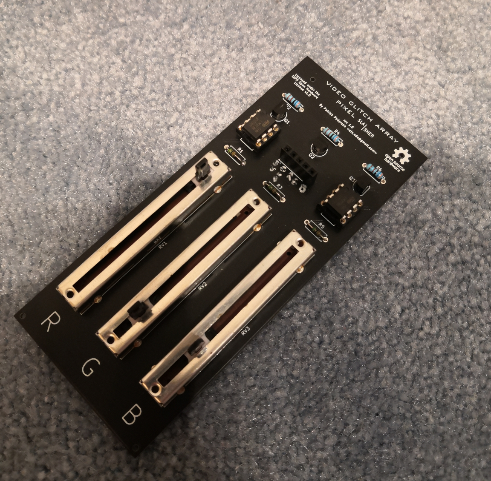
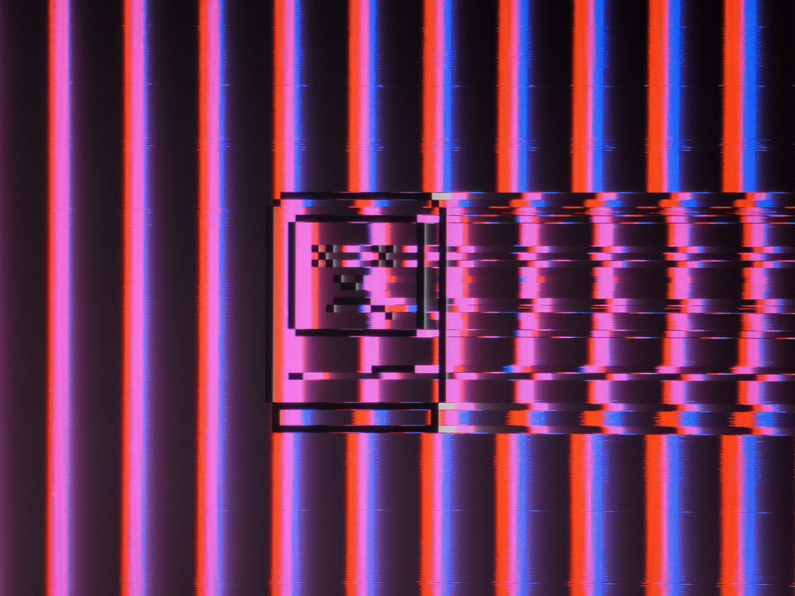
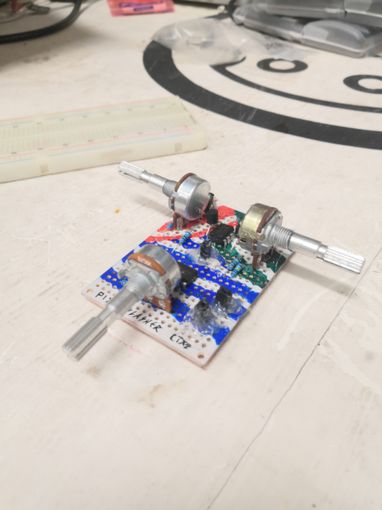
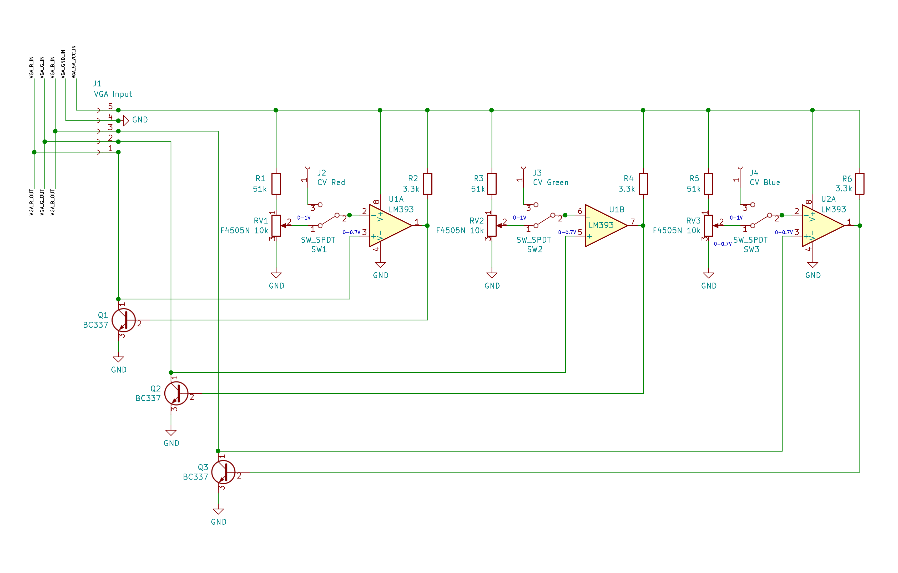
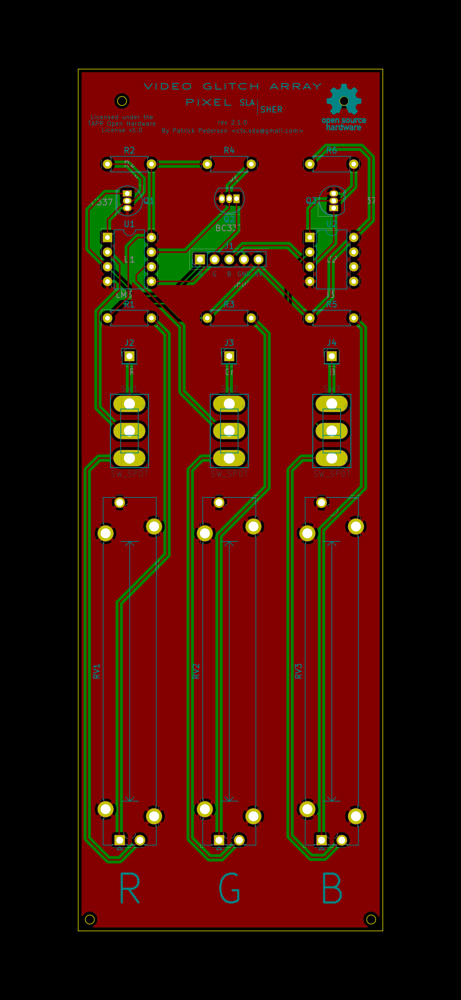

# VGA Pixel Slasher

> **NOTE: This board is still in its early stages and may contain errors or perform sub-optimally. It is subject to major changes in the future.**

*An assembled Pixel Slasher rev 1.0 board which is still missing the CV input and has a few quirky labeling errors*

The Video Glitch Array Pixel Slasher is a device which delivers some seriously interesting glitch artifacts by cutting off color signals that exceed a specific brightness.

## Showcase

Unprocessed Glitch piece from my tribute to the Hong Kong protests: [No longer fiction.](https://photos.google.com/share/AF1QipNMWo8JjrfbMHIHrRe-PMUqr3MeHh42Vb7SW4W4gQFQ75YLK24xf4YlDsXKXHZIRA?key=Mk9kSk1EZlRZaGN0d3NoUjJIX3BaeVkyb2oyOEZn)

Photography credit: Anthony Wallace

---

Just another glitched sad mac

---

Pixel slasher glitching webcam video output

## Operation

The Video Glitch Array Pixel Slasher operates by using LM393 comparators to pull down color signals as soon as they exceed a certain voltage threshold, or in other words, a brightness threshold. The voltage thresholds for each color signal can be either set using slide potentiometers, or a 0-0.7V CV signal. Switching between the potentiometers and the CV input is simply a matter of flipping a switch.

Due to the fact that the non-inverting comparator input is tied to the color signal which is also being pulled down by a generic BC337 NPN transistor driven by the LM393 comparator output, an oscillation occurs. This in combination with the rather slow response time of the LM393 induces "wavy" repeating patterns across areas that exceed the threshold voltage, which take shape according to what's projected on the display.

Since the device operates by pulling down the VGA color signals, the color signals are connected in parallel to VGA wire. Thus, to set up the pixel slasher, simply connect the 5V and GND pins to the 5V and GND pins of your VGA cable or breakout board, and connect the color signal inputs in parallel to the VGA color wires.

If you're using the [Video Glitch Array Breakout Board](../VGABreakout/), setting up the pixel slasher is just a matter of closing all switches, and connecting the breakout board outputs to the appropriate pixel slasher inputs.    

*First Pixel Slasher prototype board*

## Schematic

You can download the Schematic for the VGA Pixel Slasher [here](Docs/Schematic.pdf). Alternatively you can import this board into KiCad and browse the schematic there.

## PCB

*J2, J3 and J4 provide a CV input for each color signal*

### Files

All KiCad PCB files, as well as gerbers can be found in this directory. To order the PCB, simply grab the grab the gerbers from the `Gerbers` directory and send them to your preferred PCB manufacturer.

### Components

The following table provides a list of the necessary components along with links to some examples. It is highly recommended to do a little research yourself here. Chances are that your local hardware store might be selling some components a lot cheaper.  

|Component                |Quantity|Examples|Notes/Tips|
|-------------------------|--------|--------|----------|
|1x5 2.54mm Female Headers|1       |https://www2.mouser.com/ProductDetail/Molex/90147-1105?qs=sGAEpiMZZMs%252BGHln7q6pm8uos17B4BQAKRARw53BRV0%3D |Should you already have larger 2.54mm Female headers lying around, you could easily cut those instead of buying new ones|
|1x1 2.54mm Female Header |1       |Not available, must be cut|As 1x1 female headers aren't available commercially, they must be cut. Alternatively you can use male pin headers instead|
|4.7mm Spacing SPST or SPDT Slide Switch|3       |https://www.amazon.com/SS12D10-Straight-Spacing-SS12D10G5-Vertical/dp/B07SJPN2HM/ref=sr_1_1?keywords=4.7mm+spacing+slide+switch&qid=1569413333&s=gateway&sr=8-1 | Should these become too pricey, feel free to edit the PCB in KiCad to fit a different switch|   
|LM393 DIP-8|2|https://www.mouser.de/ProductDetail/Texas-Instruments/LM393P?qs=sGAEpiMZZMuayl%2FEk2kXcddlv8%252BlGbVFYZWyaRldvtc%3D |These will almost certainly be available for dirt cheap at your local hardware store. Any DIP8 version will do (LM393P, LM393NG, etc.). If you would like to reuse the LM393 chips later on, it may be desired to use DIP-8 sockets.|
|BC337 TO-92 (ideally straight lead)|3|https://www.mouser.de/ProductDetail/Taiwan-Semiconductor/BC337-40-A1?qs=sGAEpiMZZMshyDBzk1%2FWiwIK8FF8XsC1RNbmjp0kCPo%3D |These will almost certainly be available for dirt cheap at your local hardware store. Bent lead packages will require a little force to insert trough.|
|10k, 60mm length, 45mm travel, 9mm width, linear slide potentiometers|3|https://www.mouser.de/ProductDetail/Bourns/PTA4553-2010CIB103?qs=sGAEpiMZZMtC25l1F4XBU%252BN3R7ksrj06xuOmWpCZ94k%3D | |
|3.3k Resistors|3|https://www.mouser.de/ProductDetail/Vishay-Beyschlag/MBB02070C8200FCT00?qs=LkqrmUh5PII6P3inXi6ZTw%3D%3D&vip=1&gclid=CjwKCAjwlovtBRBrEiwAG3XJ-xNsZWIVeUh_aOER6JCOpZIqBPNapCJ1sNui1su29KHtjrVvs_qh3RoCCVQQAvD_BwE | Since these are pull-up resistors, their resistances aren't critical. Thus any ordinary 1k to 10k resistor will do just fine as well.|
|51k resistors|3|https://www.mouser.de/ProductDetail/Yageo/MFR-25FTE52-51K?qs=sGAEpiMZZMu61qfTUdNhG0IXHLFuiNnd2ZOrYz8UKLE%3D | These should be as precise as possible. A too low resistance will shorten the practical potentiometer range. A too high resistance will cause effects to still appear even at the highest resistance.|

### Soldering

When soldering, I recommend to begin with the resistors first, as those are the smallest components. Then proceed with the female headers and transistors. The solder in the LM393 chips, and last but not least, the switches and the slide pots.

Soldering the transistors leads can be a little difficult due to the density of the pins. It's highly recommended to have soldering braid/wick at your hand. In future revisions it is planned to increase the size of the transistor footprints.

### License

The VGA Pixel Slasher is licensed under the TAPR Open Hardware License v1.0 (See https://www.tapr.org/ohl.html)
