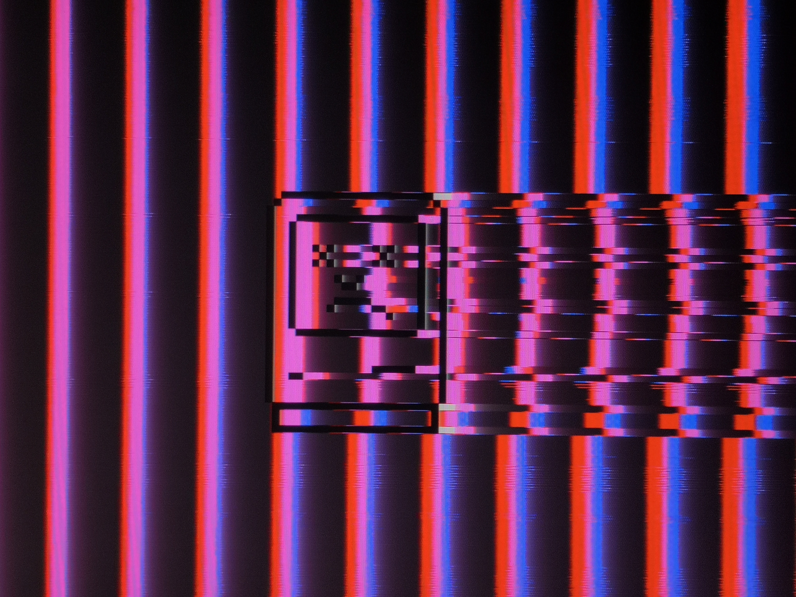

# Video Glitch Array

Video Glitch Array is a glitch art project in which I attempt to create aesthetics explicitly by manipulating VGA signals in real time trough analog and digital circuits. In a way, Video Glitch Array has become a nice sandbox for me to test and further develop my recently acquired skills in the field of electronics engineering.

## Contents

- [Why VGA](#Why-VGA)
- [Brief summary of how VGA works](#Brief-summary-of-how-VGA-works)
- [Circuits](#Circuits)
- [Open Hardware](#Open-Hardware)
- [Credits](#Credits)
- [Demonstrations](#Demonstrations)

## Why VGA

Quite frankly, the initial reason why I chose to tamper with VGA signals over, say the much more common and within the analog glitch art community preferred composite video signals, is because that is simply what I had available at home. That being said, while VGA certainly has its drawbacks when it comes to glitch art, mostly due to the presence of the horizontal and vertical sync signals, it also comes with a variety of advantages.

While the VGA port has practically gone extinct from host peripherals, it is still very common to find a VGA port on most displays, including many released even at the time of writing. Yet I am not aware of many LCD displays and projectors that support composite video. While HDMI and DVI ports are equally common, if not even more common than VGA at this point (with HDMI becoming more and more of a dominant player), those are digital interfaces and as many could imagine, are more clunky and difficult to work with. Another big advantage that VGA offers over composite is the absence of region specific differences. The VGA signal protocol, although a little hidden from the common user, is well established and standardized by now. Oh, and did I mention that VGA comes with its own 5V supply bus which can be used to power your glitch circuits without an external power source?

I could likely be going on forever, but I believe I have already managed to demonstrate that VGA can be an attractive medium for glitch art.

## Brief summary of how VGA works

I could explain how VGA signals work, however due to my brutally honest laziness and lack of competence in explaining things, I will leave you with a few resources which in my opinion do a much better job of explaining VGA than me. Many of the resources below explain VGA as part of a guide to create your own VGA driver, so it is not expected, nor required, that everything is understood.

- [VGA - the Rest of the Story](http://www.xess.com/blog/vga-the-rest-of-the-story/) by Dave Vandenbout
- [VGA Video Output](http://web.mit.edu/6.111/www/labkit/vga.shtml) by Natahn Ickes
- [LCD monitors: Clock/Pitch and Phase controls for analog-input](http://www.techmind.org/lcd/phasexplan.html) by William Andrew Steer
- [VGA ECE3534](https://drive.google.com/file/d/1oJ0iN84QY8XnXu3txFdtZf11J46l7f6y/view?usp=sharing) by Virginia Tech (Pardon the mirror, but I can no longer find the original source)
- [The world's worst video card?](https://www.youtube.com/watch?v=l7rce6IQDWs&t=976s) An amazing two part guide by Ben Eater
- [SW6 VGA Audio](http://www.partyzant.com.pl/instrukcje/matrixy/SW6_VGA_Audio.pdf) by Extron(R) Electronics, which provides fairly standard impedance specifications

Further, check out this [Stack Overflow question](https://electronics.stackexchange.com/questions/221536/vga-driver-not-working) which answers why there is no output when you apply a constant color signal. This will save you a large headache and time!

## Circuits

Each circuit has its very own directory in which you can find all ki-cad files, gerbers, and sometimes even LTSpice simulations. Every directory also comes with its very own README where I attempt to explain how the circuit works, which parts to order, as well as demonstrate the results provided by the circuit.

All my circuits follow a specific revision system.

- Schematics: [MAJOR].[MINOR]
- PCBs: [SCHEMATIC MAJOR].[SCHEMATIC MINOR].[PCB]

Here is a list of my current circuits:

- [VGA Breakout](https://github.com/CTXz/Video-Glitch-Array/tree/master/VGABreakout/README.md)
- [Pixel Slasher](https://github.com/CTXz/Video-Glitch-Array/tree/master/PixelSlasher/README.md)

## Open Hardware

Being a large supporter of open source software and hardware, it should go without saying that all circuits within this repository are licensed by the [TAPR Open Hardware License v1.0](https://tapr.org/ohl.html).

In the simplest terms, shall you decide to alter this project yourself and release the result, this license demands you to publish all changes that you have done. Commercial use, including commercial distribution of the circuits for ones own profit, is perfectly allowed as long as you comply with the license.

The last thing I would want to see is somebody enhancing my work and not sharing his progress with others.

## Credits

I would primarily like to thank the [brmlab hackerspace](https://brmlab.cz/) in Prague which has been providing me with the necessary knowledge, components and equipment to realize my ideas. I have also been granted the amazing opportunity to represent a part of the hackerspace on numerous "maker" exhibitions.

I would also like to thank the ["Glitch Artist Collective" discord server](https://discord.gg/r6NnsXX) for the great support and feedback I have been getting for my work.

## Contact

If you have any questions, I am frequently active on the ["Glitch Artist Collective" discord server](https://discord.gg/r6NnsXX)'s Circuit Bending & Analog Hardware channel. Alternatively you can send an email to `ctx.xda@gmail.com` where I will gladly answer your question(s).

## Demonstrations

You can find many more demonstrations on my [Instagram account for glitch art](https://www.instagram.com/video.home.systems/) where I also frequently provide updates on this project.

Photo Credit: Elson Li
