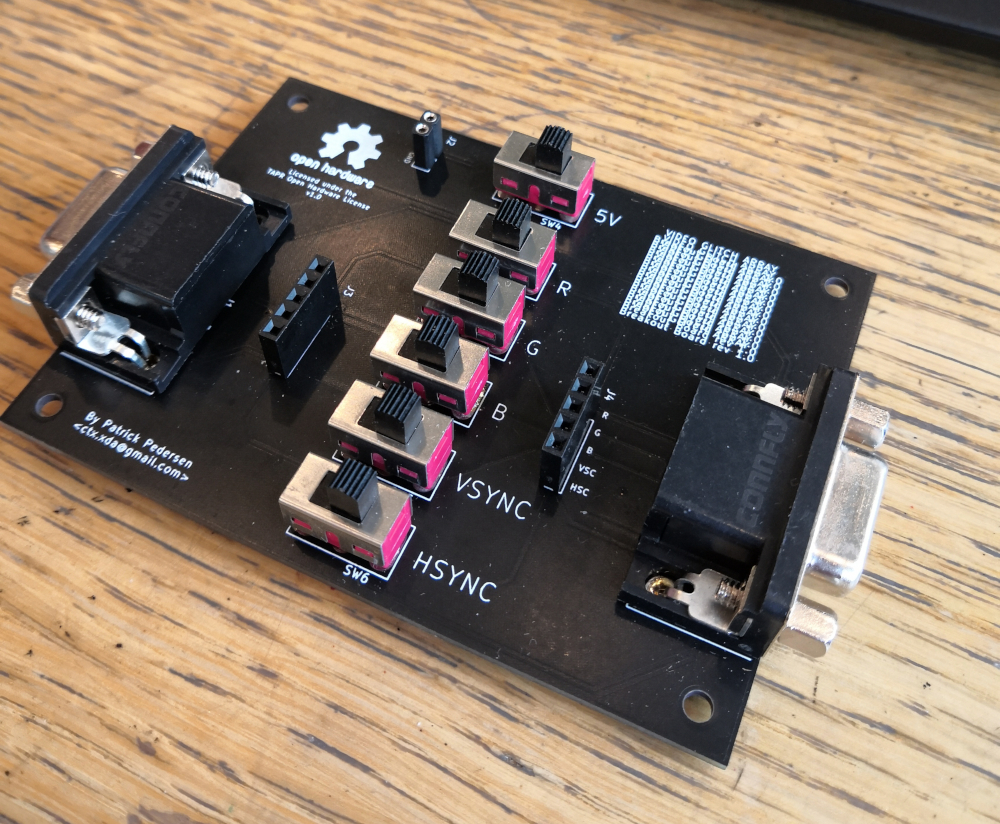
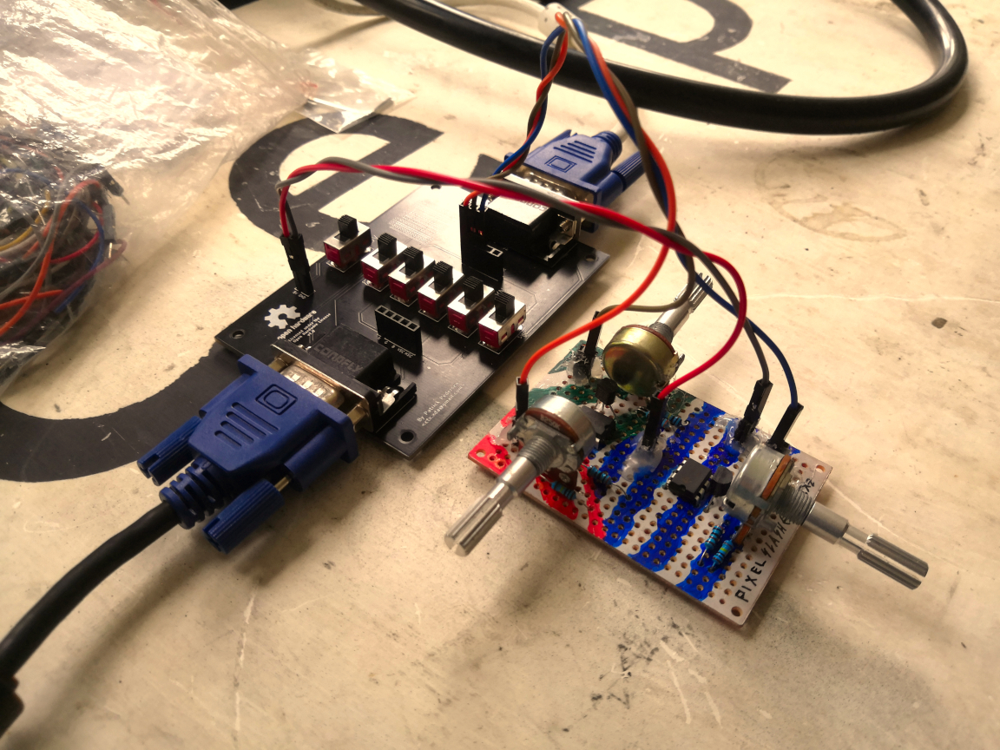

# VGA Breakout

The Video Glitch Array Breakout board offers a clean and convenient replacement for messy generic VGA breakout boards. This board was developed out of the frequent frustration of having to deal with a rat's nest of cables and loose contacts.

In the upcoming future it is planned to add a amplifier section to the breakout board, to make interfacing with modular electronics easier.

## Operation

The VGA breakout board takes a incoming VGA signal on one side of the board and outputs an outgoing VGA signal on the other side of the board. At the moment, the orientation for plugging in the VGA cables is irrelevant, however this may change in the future with the addition of an amplifier. Only the relevant signals necessary for VGA glitching (R, G, B, HSYNC, VSYNC, 5V) are broken out. For each broken out signal/pin, with the exception of the 5V and ground pin, two ports are are provided, one at the input and one at the output.

Between the input and output, a SPST switch is present for every broken out signal. The operation of the input and output ports depends on the state of the SPST switch:

- When the switch is closed, the signal will pass trough. Devices connected on either of the two breakout ports will be connected in parallel. 

- When the switch is opened, the signal can't pass trough. Devices connected accross both breakout ports will be connected in series.

The 5V switch is there to increase the supply current on the 5V pin. It is highly recommended to initially keep the 5V switch closed as it may be required to power the monitors internal EEPROM that provides the host peripherals with generic information such as the display model, resolution etc. Once initialized, feel free to open the switch.

## Schematic

You can download the Schematic for the VGA Breakout board [here](Docs/Schematic.pdf). Alternatively you can import this board into KiCad and browse the schematic there.

## PCB

### Files

All KiCad PCB files, as well as gerbers can be found in this directory. To order the PCB, simply grab the grab the `Gerbers` from your gerbers directory and send them to your preferred PCB manufacturer.

### Components

The following table provides a list of the necessary components for the breakout board, along with links to some examples. It is highly recommended to do a little research yourself here. Chances are that your local hardware store might be selling some components allot cheaper.  

|Component                |Quantity|Examples|Notes/Tips|
|-------------------------|--------|--------|----------|
|1x2 2.54mm Female Headers|1       |https://www2.mouser.com/ProductDetail/Molex/90147-1102?qs=sGAEpiMZZMs%252BGHln7q6pm8uos17B4BQAkcs7fV01%2F0k= |Should you already have larger 2.54mm Female headers lying around, you could easily cut those instead of buying new ones|
|1x5 2.54mm Female Headers|2       |https://www2.mouser.com/ProductDetail/Molex/90147-1105?qs=sGAEpiMZZMs%252BGHln7q6pm8uos17B4BQAKRARw53BRV0%3D |Should you already have larger 2.54mm Female headers lying around, you could easily cut those instead of buying new ones|
|4.7mm Spacing SPST or SPDT Slide Switch|5       |https://www.amazon.com/SS12D10-Straight-Spacing-SS12D10G5-Vertical/dp/B07SJPN2HM/ref=sr_1_1?keywords=4.7mm+spacing+slide+switch&qid=1569413333&s=gateway&sr=8-1 | Should these become too pricey, feel free to edit the PCB in KiCad to fit a different switch|   
|DS1038-15FBNSIA74 D-SUB 15 Connector|2|https://www.tme.eu/gb/details/dmr15f-hd/d-sub-connectors/connfly/ds1038-15fbnsia74/ | Should these become too pricey or are locally unavailable, feel free to edit the PCB in KiCad to fit a different D-SUB 15 connector|

### Soldering

When soldering, I highly recommend to begin with the female headers first, as those are the smallest components. Then proceed with the D-SUB connectors and finally the switches.

### License

The VGA Breakout Board is licensed under the TAPR Open Hardware License v1.0 (See https://www.tapr.org/ohl.html)
